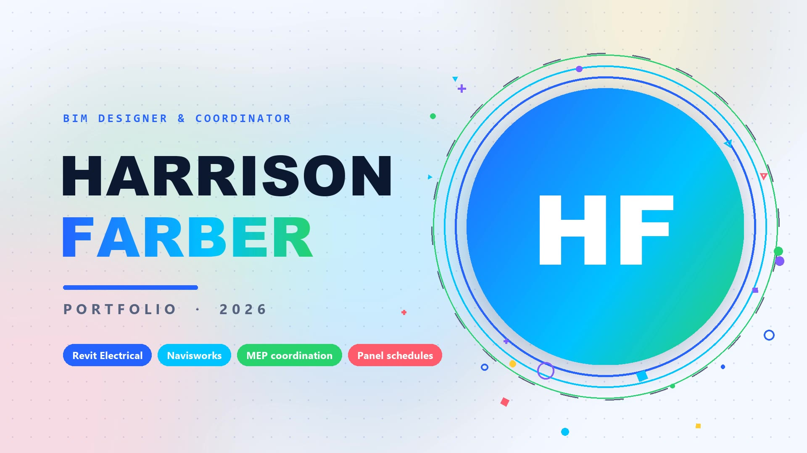
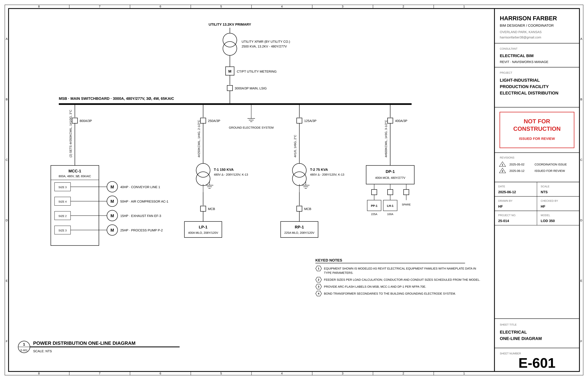
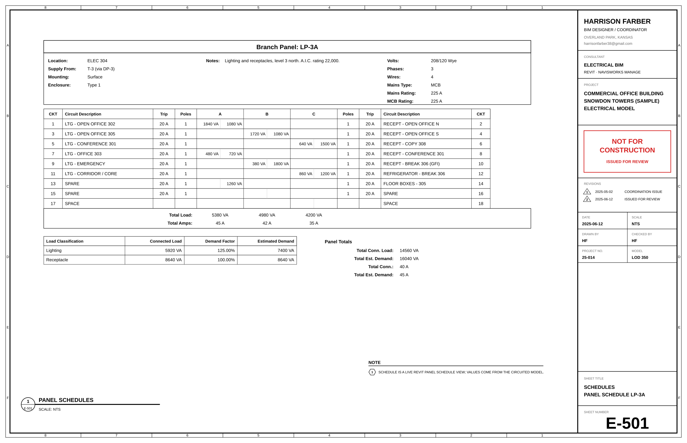

# Harrison Farber — BIM Designer & Coordinator

Portfolio website for Harrison Farber: Revit modeling, MEP coordination and Navisworks clash detection, with BIM models that can be built.

<p align="center">
  
</p>

**[Watch the showreel](assets/video/portfolio-showreel-bright.mp4)** · [LinkedIn](https://www.linkedin.com/in/harrison-farber-7b383943b) · [harrisonfarber38@gmail.com](mailto:harrisonfarber38@gmail.com) · Overland Park, Kansas

## Projects

| Project | Context | Highlights |
|---|---|---|
| Industrial Facility — Electrical Distribution & Cable Tray Model | Independent, 2025 | Switchboard, transformers, MCC and panelboards; ladder tray and conduit with NEC working clearances; Navisworks clash detection against steel and process piping |
| Commercial Office Building — Electrical Model | Independent, 2025 (Snowdon Towers sample) | Lighting and power devices circuited to panelboards; load classifications; panel schedules from the model |
| Multi-Building Campus Equipment Modeling | FMX, BIM Modeler, 2023–2024 | Levels, rooms and equipment modeled from client DWGs; Python QA rules for model cleanup |
| BIM-to-Facilities Model Handover Pilot | FMX, BIM Coordinator, 2024–2025 | Model-quality requirements and IFC4 export so equipment data reaches the facilities system without re-keying |

<p align="center">
  
  
</p>

## Tech stack

MERN: **MongoDB** (Mongoose) · **Express** API · **React** (Vite) · **Node.js**

```
client/   React app (sections: hero, showreel, skills, projects, experience, process, coordination, education, contact)
server/   Express API: /api/projects, /api/profile, /api/messages (contact form)
assets/   images, drawing sheets and the showreel video
tools/    build_diagrams.py (drawing sheets), make_video_bright.py (showreel)
```

## Run locally

```bash
npm install
npm run build      # build the React client
npm start          # http://localhost:5000
```

For development with live reload: `npm run dev` (client on http://localhost:5173).

The contact form needs a database: set `MONGODB_URI` in `server/.env` (see `server/.env.example`). Without it, the site still serves all portfolio content.

## Regenerate media

```bash
python tools/build_diagrams.py       # drawing sheets → assets/images/diagrams
python tools/make_video_bright.py    # showreel → assets/video
```

Requires Python 3 with Pillow, numpy and imageio-ffmpeg. Photo credits: [assets/images/stock/CREDITS.md](assets/images/stock/CREDITS.md).
